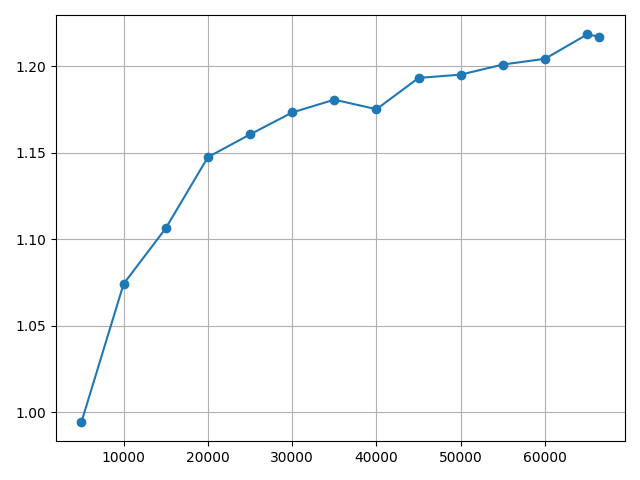

# ViTCAP

 This repo contains the code for CVPR-2022 paper [Injecting Semantic Concepts into End-to-End Image Captioning](https://arxiv.org/abs/2112.05230).

  

 ViTCAP is an end-to-end transformer-based image captioning model. ViTCAP takes the raw images as input and predict: 
 1. Semantic concepts exist in the image, and 
 2. an open-form textual description of the image. This repo contains the implementation and evaluation of ViTCAP on COCO-captioning dataset.
 
 
 ## ViTCAP Demo
  
  Please see [Loading Script.ipynb](Loading%20Script.ipynb) for a quick demo to load a trained ViTCAP checkpoint for inference.
  
 
 ## Dependencies
  The project enviroment in my local is PyTorch 1.6:
  
  `conda install pytorch==1.6.0 torchvision==0.7.0 cudatoolkit=10.1 -c pytorch`
  
  `pip install -r requirements.txt`
  
  Construct the coco_caption tool, place the [coco_caption]() in `./src/tools/captioning`, then execute `./get_stanford_models.sh`. Place the [cider]() tool in `./src/tools/captioning` for CIDEr metric computation. 

 ## Dataset
  
 Download the [COCO-captioning TSV files]() and place it in `./data/coco_caption`. 
 (**Please do not distribute it for commercial use due to possible copyright concern.** Otherwise I might have to retract it soon which causes great inconvenience for future researchers.)
   
 For the large scale pre-training corpus of ViTCAP, refer to [VinVL Repo](https://github.com/microsoft/Oscar/blob/master/VinVL_DOWNLOAD.md) for downloading large scale VL corpus.
 
 I do not plan to further update the VL pre-trained ViTCAP and their evaluations on other benchmarks at this time. Please refer to other implementations like [OSCAR/VinVL](https://github.com/microsoft/Oscar) for extension.

 ## Training & Evaluation
 The bellowing commands will do the training & evaluation.
 
 To conduct the training (optimized by cross-entropy), modify the `type` in the YAML file to `pipeline_train_eval_multi`, and run:
  ```
    python run.py -c ./yaml/ViTCAP_Captioning_batch-size_512_encoder_vit_base_patch16_384_lr_1e-4_iter_60_vitbfocal20_bert_tokenizer_tags_ENC-DEC_multiplier_0.1.yaml.yaml
 ```
 
 <em> Note: there seems to have an error when I try to initialize the PyTorch DDP mode in my local machine. As I previously conduct the whole experiments on Azure, which were bug-free, I'm not sure what leads to the DDP mode error in my local machine at this time but probably they should be good in your machine. Due to my limit time, I'll try fix this bug in future. But regularly, to start the DDP job, set the MASTER_ADDR, WORLD_SIZE parameters in ubuntu enrivon. The trainer should be able to auto start the DDP training. </em>


 To conduct evaluation, modify the `type` in the YAML file to `pipeline_eval_multi`, and run:
 
 ```
    python run.py -c ./yaml/ViTCAP_Captioning_batch-size_512_encoder_vit_base_patch16_384_lr_1e-4_iter_60_vitbfocal20_bert_tokenizer_tags_ENC-DEC_multiplier_0.1.yaml.yaml
 ```
 
 For example, to use the pre-trained checkpoint for evaluation, copy
 ```
    ./checkpoint/Logit_Vilt_captioning_testing_batch-size_512_encoder_vit_base_patch16_384_lr_1e-4_iter_60_vitbfocal20_bert_tokenizer_tags_ENC-DEC_multiplier_0.1_expand_tag-classifier_emb.pt
 ```
 to `./output/XXX/snapshot/model_iter_XXX.pt`. XXX depends on the batch size, and you will get a prompt <em>no model_iter_XXX.pt checkpoint found</em> if not correct, and just rename it would be fine accordingly.
 If everything is correct, this should give your the results of ViTCAP:
 
BLEU-4 | CIDEr  | METEOR | ROUGE | SPICE |
---------|---------|---------|---------|---------|
35.7  |   121.8 | 28.8 | 57.6 | 22.1

 To conduct the CIDEr optimization, modify `scst` to True and tune `scst_num_return` if GPU memory is not sufficient. Note that CIDEr optimization consumes very large memories and I just randomly sample just 70% tokens and reduce batch size and `scst_num_return` to 2 for training on my V100 devices. This probably indicates that better CIDEr score is very likely to be reached if using a larger memory device (say, A100) or better sampling method or larger scst_num_return number.
 
 
 ## Checkpoint
 
 Download the COCO-caption pre-trained checkpoint [here]() (Cross-entropy optimized).
 
 Download the concept classification trained ViT checkpoint. We find that it is essential to use the semantic classification optmized ViT to initialize ViTCAP, which is trained to predict the image-level concepts with 4 million images.
 
 The training log of can be found in [here](./checkpoint/Logit_Vilt_captioning_testing_batch-size_512_encoder_vit_base_patch16_384_lr_1e-4_iter_60_vitbfocal20_bert_tokenizer_tags_ENC-DEC_multiplier_0.1_expand_tag-classifier_emb.txt). The results across difference epochs are shown as below:
 
     
     
  
 
 From left to right: <em> BLEU-4, CIDEr, METEOR, ROUGE, SPICE </em>.
    
 ## ToDo
- [x] Training and evaluation code
- [x] Quick demo notebook code.
- [x] COCO training TSV file.
- [x] COCO pre-trained checkpoint.
- [ ] Visualization codes for predicted semantic concepts and grounded visual concepts.
- [ ] Implementation on no-caps and Google-CC and pre-training. No plan at this time. 
 
 
 ## Citation
  
 Please cite our work if you find it helpful:
  
```bibtex
@inproceedings{fang2021injecting,
title={Injecting Semantic Concepts into End-to-End Image Captioning},
author={Zhiyuan Fang, Jianfeng Wang, Xiaowei Hu, Lin Liang, Zhe Gan, Lijuan Wang, Yezhou Yang, Zicheng Liu},
booktitle = {CVPR},
year = {2022},
}
```

## Acknowledgments
This implementation is largely based on [Jianfeng]()'s efforts and [Microsoft Azure-Florence Group](https://www.microsoft.com/en-us/research/project/project-florence-vl/). Thanks my collaborators.


## License
ViTCAP is released under the MIT license.


